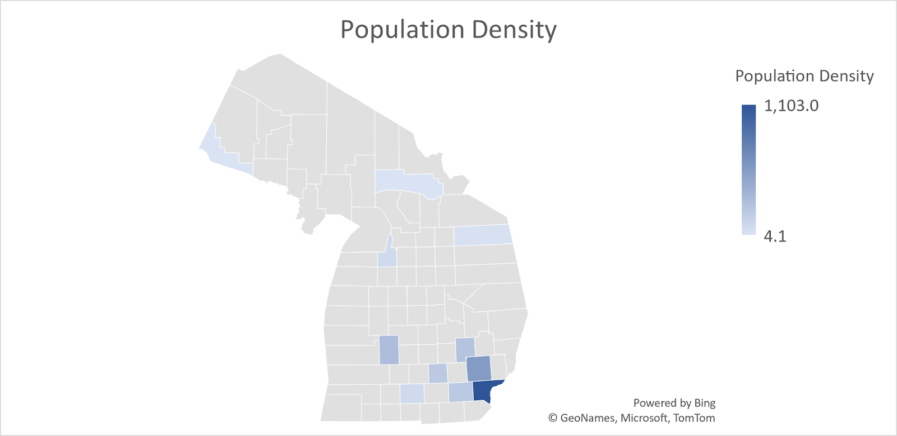
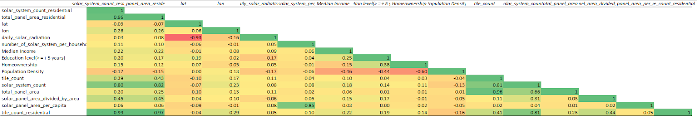

# Target-Solar-Panel-Market-in-Michigan

# Overview 

Our team is interested in discovering our target market for residential solar panels in specific regional Michigan cities. With solar panels being the cheapest form of clean and renewable energy, we are looking to focus on areas with ideal solar radiation and a minimum base income to ensure that solar panels are cost effective for the customer.

# Questions:

•	How does education level affect solar panel ownership?

•	Does home ownership affect the level of solar panel ownership?

•	What is the average number of Solar Panel Systems per region?

•	Do highly populated regions have more Solar Systems?

# Analysis

What is the average number of Solar Systems per region?

## Correlation Analysis 

Based on the correlation level, the Solar System Count Residential is positively correlated with Median income, educational level, and homeownership. This means that if one of these variables decreases the solar system count residential will decrease. The population density is negatively correlated with the Residential Solar System count this indicates that if the population density increase the Residential Solar system count will decrease.

# Machine Learning Model : Linear Regression 

Linear Regression is the supervised Machine Learning model in which the model finds the best fit linear line between the independent and dependent variable. 

## Regression Results 

### R-Square 

### Variation Inflation Factor (VIF)

### Predicition Model

# Machine Learning Model

The preliminary data investigation began with the premise that we would have to collect three distinct types of data: household data regarding income, education, work experience, et cetera (other factors that could also affect and explain our analysis such as ethnicity), solar data for the state of Michigan (to be then divided by region), and installation of solar panels.  Household data was easily found through the American Community Survey database provided by the Census Bureau. After a preliminary investigationa and discussion, we decided to go with solar irradiance data from the NREL database using their web user interface where we collected data by county using coordinates.

The most difficult data to find was the installation of solar panels on households. Whereas the first two datasets were found within a few days, the last dataset was unable to be found until we discovered a Stanford dataset created through deep learning. The Stanford dataset observed satellite data by household to detect whether solar panel installtions were on the house. The data was then included in a master dataset that encompassed the whole country. For the purposes of this project, we removed all data not related to Michigan. We were also looking to include a temporal variable to see if there was any sort of change in adaption over the span of five years, however, the deep learning dataset was built in 2018 and thus only used data for that year. 

Our machine learning model is an ordinary least square linear regression. We are looking for the factors that influence adoptation of solar panels in a community. Variables that we are to include (subject to change) include household income, education, ethnicity, etc., solar irradiance data (whether the amount of sunlight in a region plays a factor in the adaptation in solar panels), region, population. 

Therefore our dependent variable would be the percentage of households with solar panel installations. Independent variables such as household income, education, ethnicity, solar irradiance data, location characteristics (whether it is urban or rural, or in a more northern region) will be tested to see which model has the highest r-squared value, along with the p-values of each variable.The r-square value will assist in validating the effectiveness of the model and whether it will help characterize the individual most likely to install solar panels.

# Dashboard

https://public.tableau.com/app/profile/safari.nde/viz/TargetResidentialSolarPanelinMichigan/TargetSolarPanelMarketinMI?publish=yes

# Slides

https://docs.google.com/presentation/d/1LrtH7fWyHEKxciRR_yIGYUzSCKBZ0iV8DgcXWfFzEIY/edit?usp=sharing

# Resources

**Data:** 

Average Household Income MI - Census Bureau

Homeownership rate in MI - Census Bureau

Renewal Energy Sector in MI - Census Bureau

NREL National Solar Radiation Database 2015 - 2020

DeepSolar by Stanford - https://web.stanford.edu/group/deepsolar/home

# Communication Protocols

Team members collaborated using Zoom for meetings, Git Hub for subitting our work and Slack for all other communications outside of meetings. We also utilized Google Docs for an outline and Google Slides for the presentation.

# Team Members:

Eleazar Luis Escalante

Safari NDE

Kimberly Wagner-Dabbour

Kevin Paree

