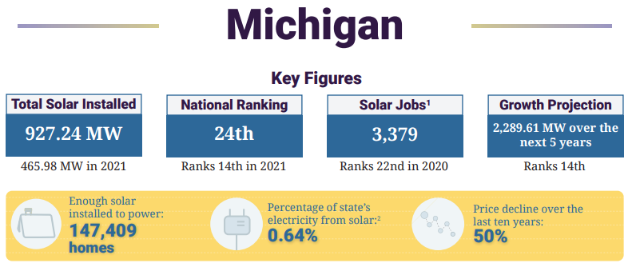

# Target Solar Panel Market in Michigan 

# Overview

Our team is interested in discovering our target market for residential solar panels in specific reginal Michigan cities. With solar panels being the cheapest form of clean and renewalable engery, we are looking to focus on areas with ideal solar radiation and a minimum base income to ensure that solar panels are cost effective for the customer.

# Analysis

What is the average income for the region?

What is the average of homeownership in the region?

What is the average residential electric use based on region?

What is the average solar radiation output for the region?

# Machine Learning Model

Linear Regression

# Example Schema

# Resources

**Data:** 

Average Household Income MI - Census Bureau

Homeownership rate in MI - Census Bureau

Renewal Energy Sector in MI - Census Bureau

NREL National Solar Radiation Database 2015 - 2020

# Communication Protocols

Team members collaborated using Zoom for meetings, Git Hub for subitting our work and Slack for all other communications outside of meetings. We also utilized Google Docs for an outline and Google Slides for the presentation.
